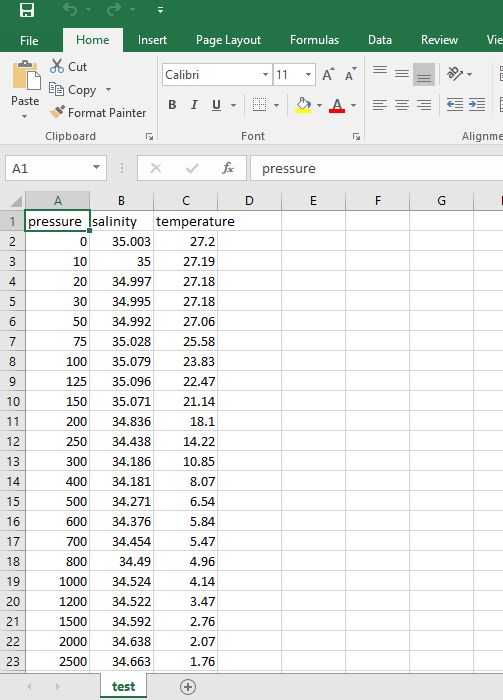
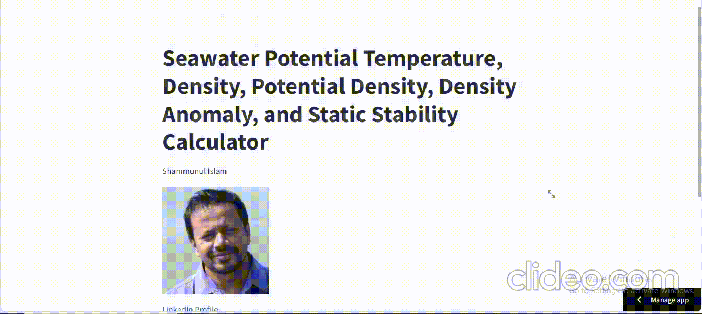
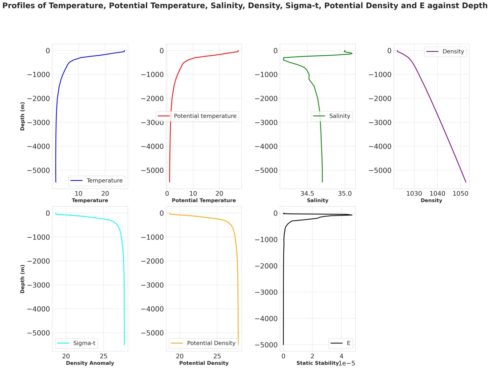
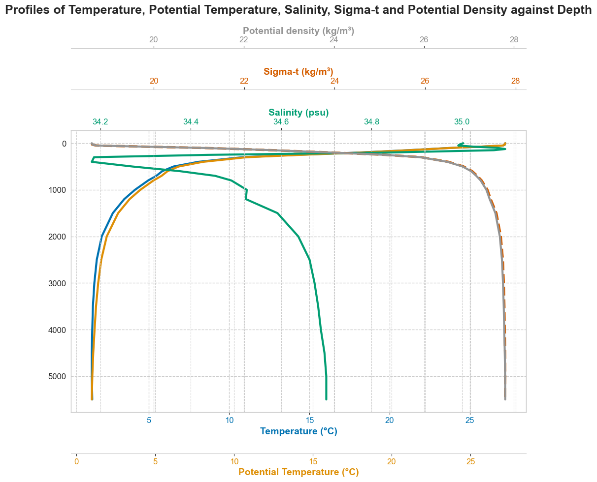

### An app to calculate Seawater Potential Temperature, Density, Potential Density, Density Anomaly, and Static Stability from salinity, temperature and pressure only

**Shammunul Islam (sislam27@mason.edu)**

## Table of Contents

- [Introduction](#introduction)
- [Installation](#installation)
- [Running the deployed app](##)
- [Screenshots](#screenshots)

## Introduction 

This app can calculate Seawater Potential Temperature, Density, Potential Density, Density Anomaly, and Static Stability if you upload a csv file with three columns "salinity", "temperature", and "pressure". It also plots some of them first in a single plot and second, in a multiple plot.

## Installation


1. Clone the repository:

   ```
   git clone https://github.com/shammun/ocean_potential_temperature_density
   ```

2. Navigate to the project directory:

   ```
   cd clim_680_hw
   ```

3. Create a virtual environment

   ```
   conda create --name streamlit_ocean python=3.11
   ```

4. Activate the environment:

   ```
   conda activate streamlit_ocean
   ```


3. Install the required packages:

   ```
   pip install -r requirements.txt
   ```

4. Run the app locally from your computer:

   ```
   streamlit run streamlit_app.py
   ```

## Running the deployed app

Click on this [link](https://oceanpotentialtemperaturedensity-ft7f3qifgqwhd8n5cqbzn5.streamlit.app/) to run the app.


## Screenshots

Below is an example dataset (.csv) that you can upload.


Below is a step-by-step video on using this app


Below is a screenshot of the first single plot


Below is a screenshot of the second multiple plots

